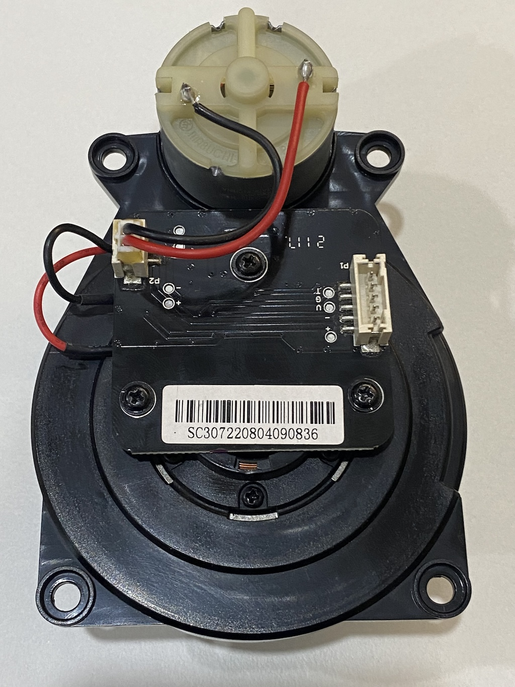
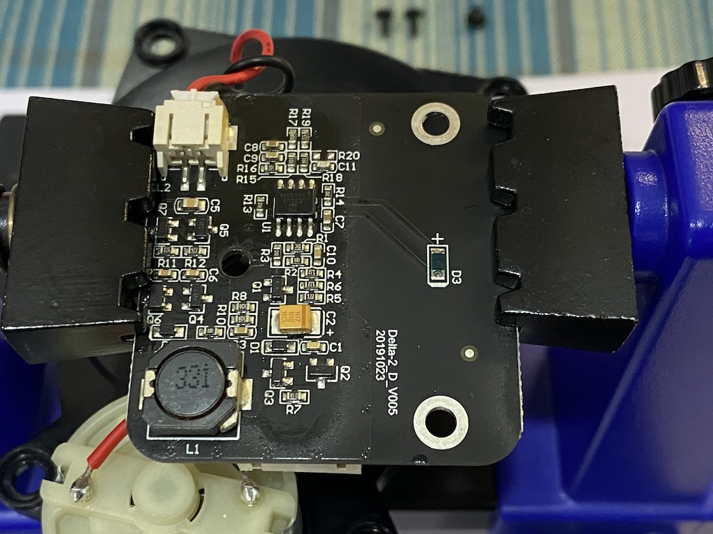
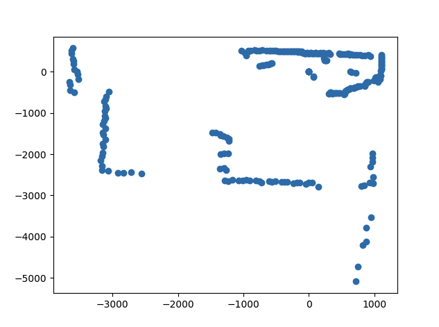

# Introduction
After removing the Lidar sensor from my robotic vacuum cleaner, my curiosity was around how this remarkable device operates. My goal was to understand the interface protocol and the inner workings of the sensor. To achieve this, I aimed to write a simple Python script to decode and plot the sensor readings, providing a visual insight into the Lidar’s functionality.

# Interface
From various posts on the internet, I discovered that most Lidar devices utilise a simple UART interface. However, I was cautious to protect my Mac Mini’s ports from potential damage. To safeguard my Mac Mini, I used a USB hub and a USB to UART module as a shield. Identifying the pin functions was relatively straightforward using the continuity feature of a multimeter. Although numerous articles cover this topic, I wanted to double-check the connections myself, given I had a multimeter readily available.

| Pin No | Wire   | Function |
|--------|--------|----------|
| 1      | White  | Motor +  |
| 2      | Black  | Motor -  |
| 3      | Red    | VCC      |
| 4      | Black  | GND      |
| 5      | Yellow | TX       |

# Protocol
Once I connected the device to my computer, I used the CoolTerm app to access the data from the USB serial port. Initially, the data appeared to be junk, but I soon noticed some pattern. After some analysis and consulting the datasheet of a similar device, I managed to decode the protocol design.

* Data Packet Structure:
	* Chunk Header: 1 byte
	* Chunk Length: 2 bytes
	* Chunk Version: 1 byte
	* Chunk Type: 1 byte
	* Command Type: 1 byte
	* Payload Length: 2 bytes
	* Payload Data: Variable length based on Payload Length
	* Payload CRC: 2 bytes
* Command Types:
	* CMDTYPE_HEALTH (0xAE): Indicates health check data.
	* CMDTYPE_MEASUREMENT (0xAD): Contains measurement data including angle and distance information.
* Payload structure
	* Offset Angle: 2 bytes, multiplied by 0.01 to get the offset angle in degrees.
	* Start Angle: 2 bytes, multiplied by 0.01 to get the starting angle in degrees.
	* Sample Count: Calculated as `((PayloadLength - 5) / 3)`. Each sample includes:
		* Signal Quality: 1 byte, representing the quality of the signal.
		* Distance: 2 bytes, multiplied by 0.25 to get the distance in millimeters.
		* Angle: Calculated as  `StartAngle + (SampleIndex * (360 / (16 * SampleCount)))`  for each sample  i .

# Result
After some tuning, the plot looks interesting and works as expected. The visual representation closely mirrors the surrounding environment, dynamically updating in real-time as the sensor detects changes. When I block the sensor at various angles, the plot adjusts accordingly, showcasing the sensor’s responsiveness and accuracy.

