# Vacuum Robot Component Connection Diagram

This diagram shows all hardware components and their connections. Each connection references evidence documented in `Connection_Evidence.md`.

**Legend**:
- ✅ PROVEN - Confirmed through testing/analysis
- 🔍 LIKELY - Strong evidence, needs final confirmation
- ❓ HYPOTHESIS - Logical assumption, needs testing
- Solid lines (`---`) - Proven connections
- Dashed lines (`-.-`) - Likely but unconfirmed connections
- Dotted lines (`···`) - Hypothetical connections

## System Architecture Diagram

```mermaid
graph TB
    %% Main processors
    A33[Allwinner A33<br/>ARM Cortex-A7<br/>Quad-Core]
    GD32[GigaDevice GD32F103VCT6<br/>ARM Cortex-M3<br/>108MHz]

    %% Navigation
    LIDAR[Lidar Sensor<br/>3irobotix Delta-2D<br/>J17]

    %% Motors and drivers
    LMOTOR[Left Wheel Motor<br/>J24]
    RMOTOR[Right Wheel Motor<br/>J27]
    BRUSH[Rolling Brush<br/>J15]
    VACUUM[Vacuum Pump<br/>J16]
    SWEEP[Sweeper Motor<br/>J26]

    %% Sensors - Safety Critical
    LENC[Left Wheel Encoder<br/>J25]
    RENC[Right Wheel Encoder<br/>J26]
    FCLIFF[Front Cliff Sensors<br/>IR L&R<br/>J5]
    LCLIFF[Left Cliff Sensor<br/>J25]
    RCLIFF[Right Cliff Sensor<br/>J26]
    LBUMP[Left Bumper<br/>J25]
    RBUMP[Right Bumper<br/>J26]

    %% Sensors - Status
    DUST[Dust Box Sensor<br/>J48]
    WATER[Water Box Sensor<br/>J48]
    MOP[Mop Pad Sensor<br/>J34]

    %% User Interface
    BTNS[Buttons<br/>Power/Home/Clean]
    SPEAK[Speaker<br/>J18]

    %% === A33 TO GD32 CONNECTIONS ===
    A33 ---|✅ UART3 TX<br/>PH6→PA10<br/>115200 baud<br/>Ref: E1| GD32
    GD32 -.-|❌ UART3 RX<br/>PA9→PH7<br/>UNUSED<br/>Ref: E2| A33
    A33 ---|🔍 GPIO<br/>PH9 gpio-233<br/>Reset/Boot?<br/>Ref: E3| GD32
    A33 -.-|🔍 GPIO<br/>PD11 gpio-107<br/>Enable?<br/>Ref: E4| GD32
    GD32 -.-|🔍 GPIO<br/>?→PB7 gpio-39<br/>Status<br/>Ref: E5| A33

    %% === A33 DIRECT CONNECTIONS ===
    A33 <===|✅ UART1<br/>PG6/PG7<br/>115200 baud<br/>Ref: E6| LIDAR
    A33 -.->|❓ GPIO/ADC<br/>Ref: E10| DUST
    A33 -.->|❓ GPIO<br/>Ref: E11| WATER
    A33 -.->|❓ GPIO<br/>Ref: E12| MOP
    A33 -.->|❓ GPIO<br/>Ref: E13| BTNS
    A33 --->|❓ I2S/PWM<br/>Ref: E14| SPEAK

    %% === GD32 CONNECTIONS - MOTORS ===
    GD32 -.->|❓ PWM<br/>Ref: E8| LMOTOR
    GD32 -.->|❓ PWM<br/>Ref: E8| RMOTOR
    GD32 -.->|❓ PWM<br/>Ref: E8| BRUSH
    GD32 -.->|❓ PWM<br/>Ref: E8| VACUUM
    GD32 -.->|❓ GPIO/PWM<br/>Ref: E8| SWEEP

    %% === GD32 CONNECTIONS - ENCODERS ===
    GD32 <-.-|❓ Timer Input<br/>Quadrature<br/>Ref: E7| LENC
    GD32 <-.-|❓ Timer Input<br/>Quadrature<br/>Ref: E7| RENC

    %% === GD32 CONNECTIONS - SAFETY SENSORS ===
    GD32 <-.-|❓ ADC/GPIO<br/>Safety Critical<br/>Ref: E9| FCLIFF
    GD32 <-.-|❓ ADC/GPIO<br/>Ref: E9| LCLIFF
    GD32 <-.-|❓ ADC/GPIO<br/>Ref: E9| RCLIFF
    GD32 <-.-|❓ GPIO<br/>Interrupt<br/>Ref: E9| LBUMP
    GD32 <-.-|❓ GPIO<br/>Interrupt<br/>Ref: E9| RBUMP

    %% Styling
    classDef proven fill:#90EE90,stroke:#006400,stroke-width:3px
    classDef likely fill:#FFD700,stroke:#FF8C00,stroke-width:2px
    classDef hypothesis fill:#87CEEB,stroke:#4682B4,stroke-width:1px
    classDef processor fill:#DDA0DD,stroke:#8B008B,stroke-width:3px

    class A33,GD32 processor
```



## Communication Protocols Detail

### ✅ PROVEN Connections

#### A33 → GD32: UART3 Command Channel
- **Protocol**: Custom binary protocol
- **Baud**: 115200, 8N1, no flow control
- **Format**: `FA FB LENGTH CMD DATA[0..N] CRC`
- **Direction**: ONE-WAY (A33 sends only)
- **Commands Known**:
  - `0x06`: Heartbeat
  - `0x0D`: Status request
  - `0x66`: Initialization/control (11 bytes payload)
- **Evidence**: [E1] in Connection_Evidence.md

#### A33 ↔ Lidar: UART1 Bidirectional
- **Protocol**: 3irobotix proprietary
- **Baud**: 115200, 8N1, hardware flow control
- **Format**: 8-byte header + variable payload
- **Commands**:
  - `0xAE`: Health status query
  - `0xAD`: Measurement data
- **Working**: Yes, tested with scan.py
- **Evidence**: [E6] in Connection_Evidence.md

### 🔍 LIKELY Connections

#### A33 → GD32: Control GPIOs
- **gpio-233 (PH9)**: Reset or Boot mode control (OUTPUT, HIGH)
- **gpio-107 (PD11)**: Enable or power control (OUTPUT, HIGH)
- **Evidence**: [E3, E4] in Connection_Evidence.md

#### GD32 → A33: Status GPIO
- **gpio-39 (PB7)**: Status line (INPUT, currently LOW)
- **Possible meanings**:
  - LOW = Ready, HIGH = Obstacle detected
  - Or inverted: LOW = Obstacle, HIGH = Ready
- **Evidence**: [E5] in Connection_Evidence.md

### ❓ HYPOTHESIS Connections

All GD32 sensor connections are hypothetical based on:
- Connector documentation
- Standard motor control requirements
- Safety-critical system design
- GD32 peripheral capabilities

These need:
- Physical connector pinout analysis
- PCB tracing
- Runtime testing
- Oscilloscope/logic analyzer capture

## Connector Pinout Summary

### J17 - Lidar (5-pin, 2mm PH)
| Pin | Function | Direction | Notes |
|-----|----------|-----------|-------|
| 1 | Motor+ | Power | 5V for rotation |
| 2 | Motor- | Power | GND |
| 3 | TX | Output | Lidar → A33 PG7 (UART1_RX) |
| 4 | RX | Input | A33 PG6 (UART1_TX) → Lidar |
| 5 | GND | Power | Ground |

Status: ✅ PROVEN through scan.py testing

### J25 - Left Wheel (16-pin, 1mm SHD)
Contains:
- Left wheel encoder (2-4 pins for A/B channels)
- Dustbox power (2 pins)
- Left side fall detect IR (2-3 pins)
- Left hit detect sensor (1-2 pins)

Status: ❓ HYPOTHESIS - needs pinout analysis

### J26 - Right Wheel (16-pin, 1mm SHD)
Contains:
- Right wheel encoder (2-4 pins)
- Sweeper motor power (2 pins)
- Right side fall detect IR (2-3 pins)
- Right hit detect sensor (1-2 pins)

Status: ❓ HYPOTHESIS - needs pinout analysis

### Other Connectors
See README.md for complete connector list.

## Evidence Reference Map

| Ref | Connection | Status | Evidence File Section |
|-----|------------|--------|----------------------|
| E1 | A33 UART3_TX→GD32 | ✅ PROVEN | "A33 → GD32 UART" |
| E2 | A33 UART3_RX←GD32 | ❌ UNUSED | "A33 ← GD32 UART_RX" |
| E3 | A33 gpio-233→GD32 | 🔍 LIKELY | "A33 → GD32 Control GPIO" |
| E4 | A33 gpio-107→GD32 | 🔍 LIKELY | "A33 → GD32 Enable GPIO" |
| E5 | A33 gpio-39←GD32 | 🔍 LIKELY | "A33 ← GD32 Status GPIO" |
| E6 | A33 UART1↔Lidar | ✅ PROVEN | "A33 → Lidar Sensor" |
| E7 | GD32←Encoders | ❓ HYPOTHESIS | "GD32 ← Motor Encoders" |
| E8 | GD32→Motors | ❓ HYPOTHESIS | "GD32 → Motor Drivers" |
| E9 | GD32←Cliff/Bumper | ❓ HYPOTHESIS | "GD32 ← Cliff Sensors" |
| E10 | A33←Dust Box | ❓ HYPOTHESIS | "A33 ← Dust Box Sensor" |
| E11 | A33←Water Box | ❓ HYPOTHESIS | "A33 ← Water Box Detector" |
| E12 | A33←Mop Pad | ❓ HYPOTHESIS | "A33 ← Mop Pad Sensor" |
| E13 | A33←Buttons | ❓ HYPOTHESIS | "A33 ← Buttons" |
| E14 | A33→Speaker | ❓ HYPOTHESIS | "A33 → Speaker" |

## Next Steps for Verification

### High Priority Tests (Can do now):
1. **Monitor gpio-39** during robot operation
   ```bash
   watch -n 0.1 'cat /sys/class/gpio/gpio39/value'
   ```

2. **Test gpio-233 toggle** to see GD32 response
   ```bash
   echo 0 > /sys/class/gpio/gpio233/value
   sleep 1
   echo 1 > /sys/class/gpio/gpio233/value
   ```

3. **Verify Lidar** (already working but document)
   ```bash
   dd if=/dev/ttyS1 bs=1 count=1000 | hexdump -C
   ```

### Medium Priority (Needs physical access):
1. Probe J25/J26 pins with oscilloscope during operation
2. Use multimeter continuity to trace PCB connections
3. Measure voltage levels at connector pins

### Low Priority (Deep dive):
1. Disassemble and probe individual sensors
2. Reverse engineer complete connector pinouts
3. Capture GD32 firmware for detailed analysis

## Updates Log

| Date | Update | Evidence Added |
|------|--------|----------------|
| 2025-10-28 | Initial diagram creation | E1-E6 documented |
| | Added power connections | Standard design |
| | Added hypothetical sensor connections | E7-E13 placeholders |

---

**Note**: This is a living document. As we test and verify each connection, the diagram will be updated with proven connections replacing hypothetical ones. Always check Connection_Evidence.md for the latest test results and evidence.
